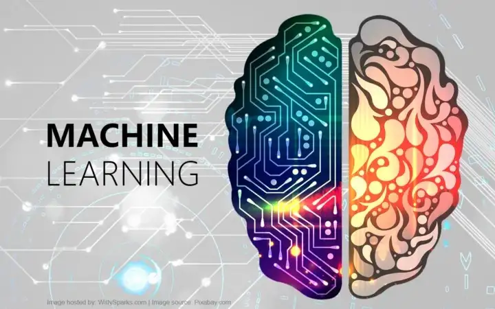

# Machine-Learning
Algoritmos de Machine Learning
# Projeto_turnover

O aprendizado de máquina (em inglês, machine learning) é um método de análise de dados que automatiza a construção de modelos analíticos. É um ramo da inteligência artificial baseado na ideia de que sistemas podem aprender com dados, identificar padrões e tomar decisões com o mínimo de intervenção humana.

Esse repositorio tem um intuito de trazer os modelos de algoritmos de Machine Learning.

  

